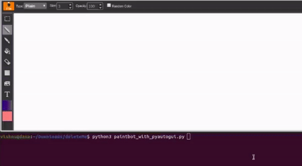

# pyautogui_paintbot
---
Creating Paint Bot using pyautogui

* The paint bot uses pyautogui to control the mouse actions
* Pass a binary image and paint bot will get the lines draw
* Lines are detected using find contour operation
* Open paint application
* The issue draw command using pywinauto mouse control

Setup

- setup the workspace using pip: pip3 install -r requirements.txt

usage

. pyautogui_paintbot.py [-h] [--imgPath] [--shiftWidth]
                             [--shiftHeight]

optional arguments

  |--help |           show this help message and exit|
  | -------------| -----|
  | --imgPath | regex path to a image location eg: *.png (default: *.png)|
  |--shiftWidth| To draw at center of screen, shift the co-ordinates. (default: 100)|
  |--shiftHeight|To draw at center of screen, shift the co-ordinates. (default: 200)|

. For this demo I have used [online paint application](https://www.youidraw.com/apps/painter/)

